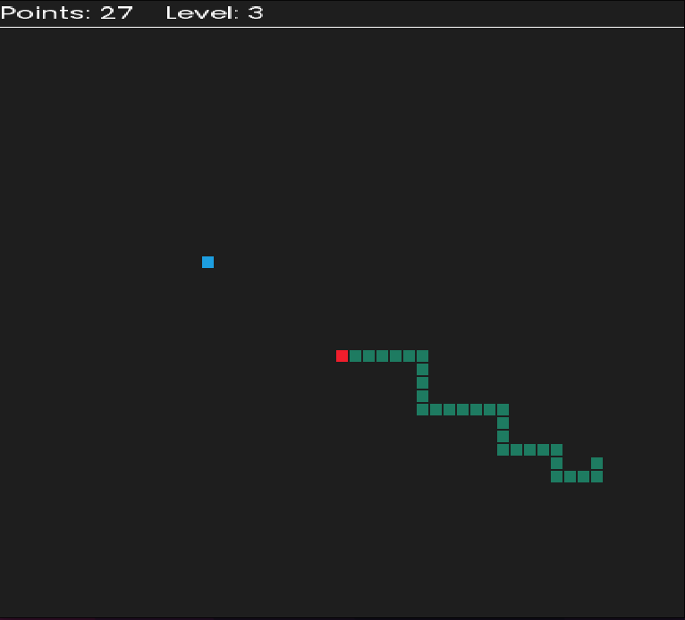
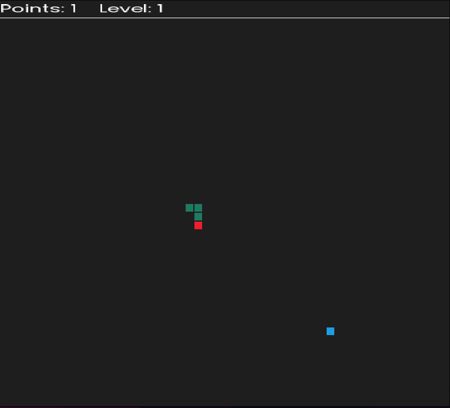

<div align="center" style="margin: 20px">
	<picture>
		<source media="(prefers-color-scheme: dark)" srcset="./screen/anaconda_light.svg" width="40%">
		
	</picture>
	<h1>Anaconda</h1>
	<p>An snake game written in C with help of SDL</p>
</div>

## Preview
<div>
	
	
</div>

## Build

Requirements:
- [**SDL**](https://github.com/libsdl-org/SDL)

[Install SDL on Linux](https://gist.github.com/aaangeletakis/3187339a99f7786c25075d4d9c80fad5)

You can clone the project and compile it yourself:
```bash
git clone "https://github.com/empitrix/anaconda_sdl.git"
cd ./anaconda_sdl

# compile
gcc ./snake.c -o ./snake.out `sdl2-config --cflags --libs` -lSDL2 -lSDL2_mixer -lSDL2_image -lSDL2_ttf

```
Now you can run `./snake.out` to play the game.

- You can quit the game by pressing `q`.

[**Wish to play Anaconda on your Linux terminal?**](https://github.com/Empitrix/anaconda)

